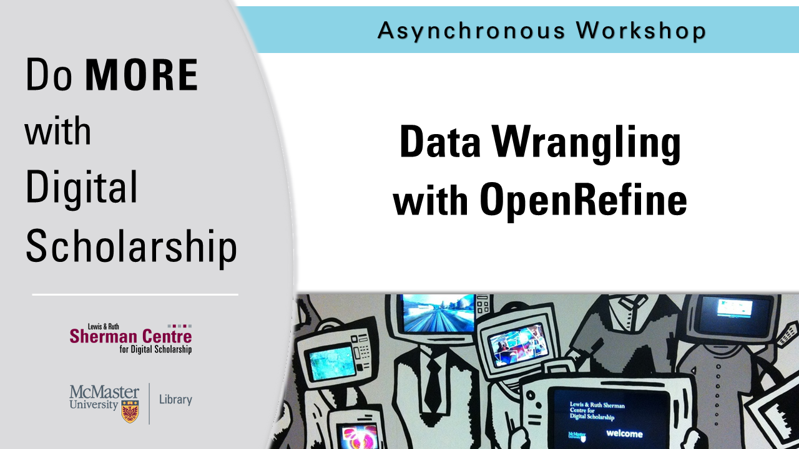

<!-- Edit the content below for the workshop in question. Once you're ready to publish, remove the comment characters e.g. "<!--" at the start and end -->

# Welcome to Data Wrangling with OpenRefine. 

In this workshop, participants will learn the basic principles of data wrangling, and will use a hands-on approach to gain fundamental knowledge and practical experience with exploring, cleaning, and transforming data into more interoperable and reusable forms.

Proceed to the [Preparation](preparation) page to get started.

<!--
You might not think of numbers and locations as Humanities data, but it all depends on how you use them! Working with numeric and spatial data, you will learn how to create visualizations in [Tableau](https://www.tableau.com/).

-->

